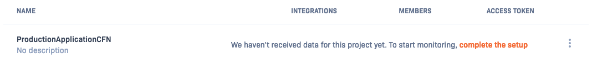
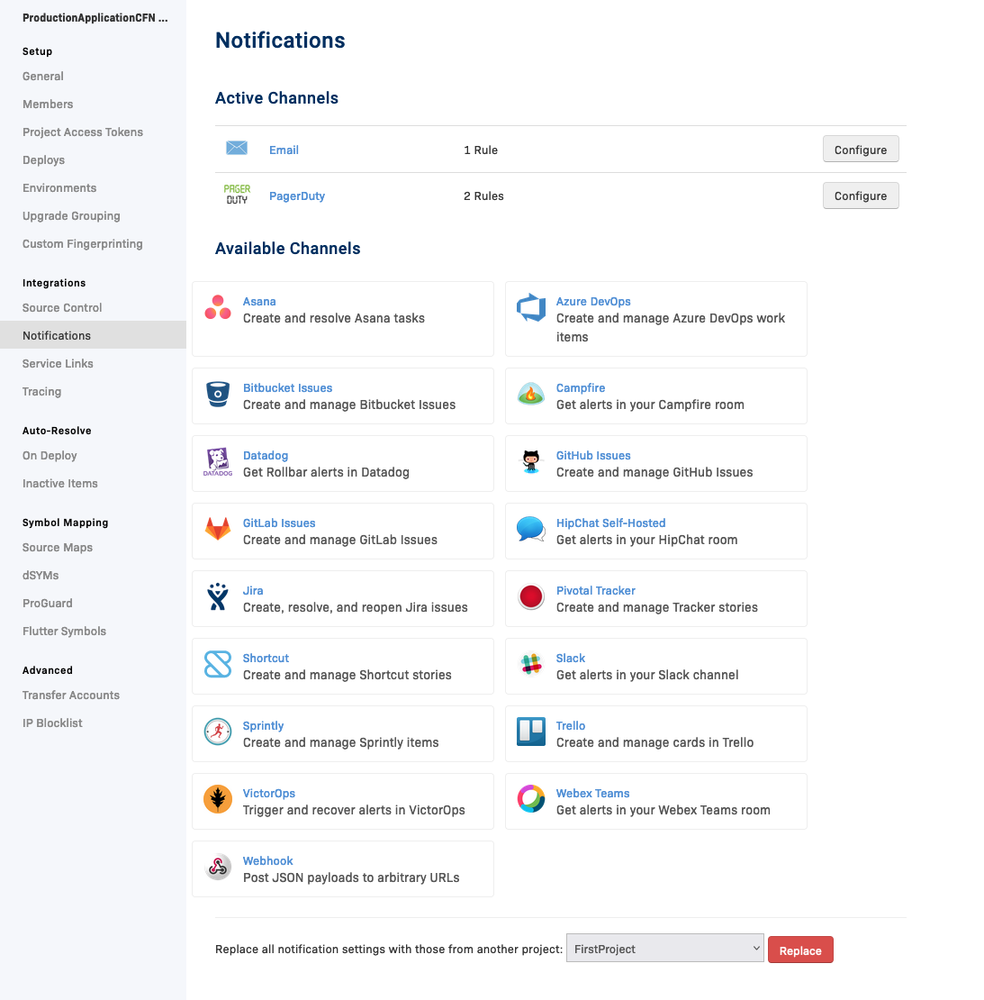
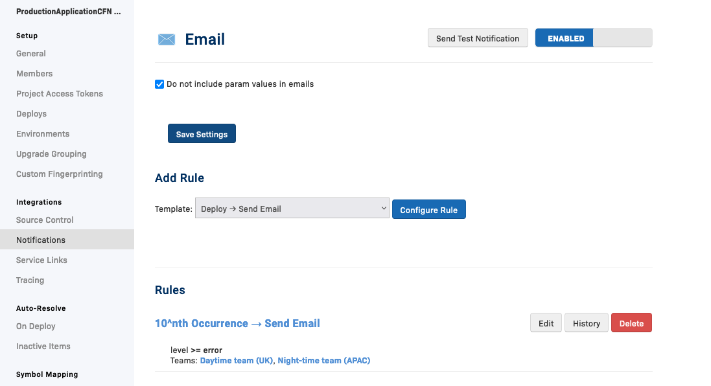
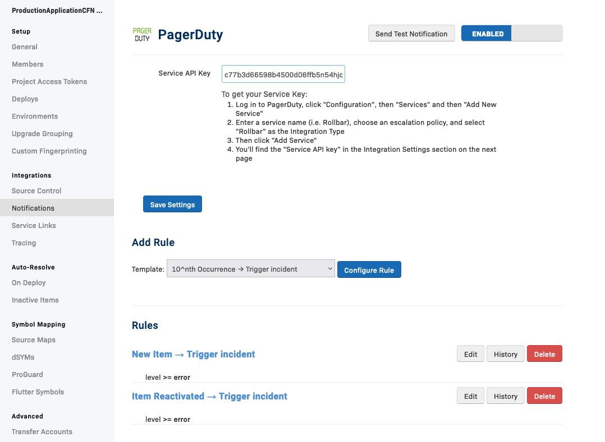
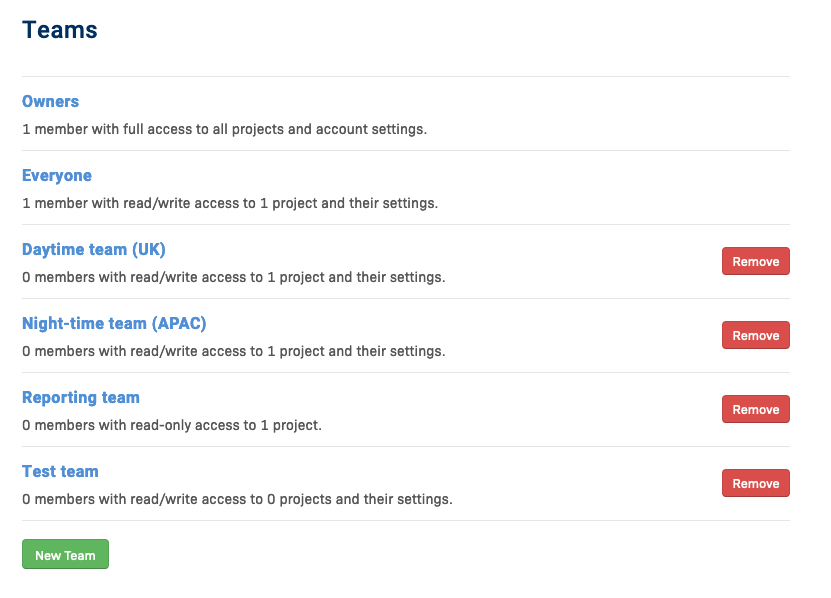

# Set up a new Rollbar project

With the Rollbar resources for CloudFormation, you can kick off the discovery and monitoring your application errors efficiently and consistently.

Project build pipelines and other project-bootstrap infrastructure can also be included
as part of the CloudFormation, so organizations can have a quick and common way to bootstrap a new project.

This demo will use the following types:

* `Rollbar::Projects::Project` - to gather error reports of an application in Rollbar.
* `Rollbar::Projects::AccessToken` - to be able to send data to a Rollbar project.
* `Rollbar::Teams::Team` - to manage rollbar team.
* `Rollbar::Teams::Membership` - to manage membership of a rollbar team.
* `Rollbar::Notifications::Rule` - to define a notification rules for a Rollbar project.

See the [full CloudFormation template](example.yaml) for an overview of the stack.

## Integration with 3rd party (optional)

Rollbar can integrate with various different 3rd party vendors for notification purposed. Currently, the resources
supports the following:
- Slack
- PagerDuty
- Webhook
- Email

In this example, we will configure Rollbar notification with PagerDuty. For this, we will need a PagerDuty access token
which will be defined as a stack parameter `PagerDutyApiToken`. We will also ask the display for the teams that we will
create, because we need to reuse them later on:

```yaml
Parameters:
  DayTeamName:
    Type: String
    Description: Display name of the day team
  NightTeamName:
    Type: String
    Description: Display name of the night team
  ReportingTeamName:
    Type: String
    Description: Display name of the reporting team
  PagerDutyApiToken:
    Type: String
    Description: API Token to connect to PagerDuty. Ideally this should be generated by a CloudFormation resource but the provider doesn't support this yet.
```

## Create a project

In order to receive error reports, we need first to create a project on Rollbar. We want this project to notify us over
email and PagerDuty. We will also create an access token for that project that can be injected multiple parts of
our application like lambdas, EC2 instance, etc. In addition, we will also expose this access token as a stack output
so other CloudFormation stack can have access to it, if needed.

```yaml
Resources:
  RollbarProductionApp:
    Type: Rollbar::Projects::Project
    Properties:
      Name: ProductionApplication
      Email:
        Enabled: true
        IncludeRequestParams: true
      PagerDuty:
        Enabled: true
        ServiceKey: !Ref PagerDutyApiToken

  RollbarProductionAppAccessToken:
    Type: Rollbar::Projects::AccessToken
    Properties:
      ProjectId: !GetAtt RollbarProductionApp.Id
      Name: Access token
      Scopes:
        - write
        - read
      RateLimitWindowSize: 60
      RateLimitWindowCount: 10

Outputs:
  IntegrationToken:
    Value: !Ref RollbarProductionAppAccessToken
    Export:
      Name: !Sub "${AWS::StackName}-RollbarProductionAppAccessToken"
```

## Assigning teams to the project

It's typically good practice to give access to teams so they have all the tools at their disposal to work out any issues
that might arise. In this scenario, let's say that we have 2 technical teams into 2 different timezones to manage issues 24/7.
We also have another team of project management people that need access to high level information for reporting.

Let's give these 3 teams access to our project on Rollbar:

```yaml
  DayTeam:
    Type: Rollbar::Teams::Team
    Properties:
      Name: !Ref DayTeamName
      AccessLevel: standard
  NightTeam:
    Type: Rollbar::Teams::Team
    Properties:
      Name: !Ref NightTeamName
      AccessLevel: standard
  ReportingTeam:
    Type: Rollbar::Teams::Team
    Properties:
      Name: !Ref ReportingTeamName
      AccessLevel: view

  RollbarProductionAppDayTeamMembership:
    Type: Rollbar::Teams::Membership
    Properties:
      TeamId: !GetAtt DayTeam.Id
      MemberId: !GetAtt RollbarProductionApp.Id
      MemberType: project
  RollbarProductionAppNightTeamMembership:
    Type: Rollbar::Teams::Membership
    Properties:
      TeamId: !GetAtt NightTeam.Id
      MemberId: !GetAtt RollbarProductionApp.Id
      MemberType: project
  RollbarProductionAppReportingTeamMembership:
    Type: Rollbar::Teams::Membership
    Properties:
      TeamId: !GetAtt ReportingTeam.Id
      MemberId: !GetAtt RollbarProductionApp.Id
      MemberType: project
```

# Defining notification Rules

Now that we have our projects and teams defined, it's time to configure notifications different channels. The project has
been set up to send notification over email and PagerDuty however, we still need to configure the triggers for these notifications
to be sent: this is done via notification rules.

For instance, we want to send a PagerDuty alert when a new error report is created or reopened. On top of that, If something is
triggering exponentially a lot of reports for the same error then we want to send an urgent email.

```yaml
  PagerDutyNewItemRule:
    Type: Rollbar::Notifications::Rule
    Properties:
      ProjectAccessToken: !Ref RollbarProductionAppAccessToken
      PagerDuty:
        Trigger: new_item
        Filters:
          - Type: level
            Operation: gte
            Value: error
  PagerDutyNewReopenedItemRule:
    Type: Rollbar::Notifications::Rule
    Properties:
      ProjectAccessToken: !Ref RollbarProductionAppAccessToken
      PagerDuty:
        Trigger: reactivated_item
        Filters:
          - Type: level
            Operation: gte
            Value: error
  EmailNewReopenedItemRule:
    Type: Rollbar::Notifications::Rule
    Properties:
      ProjectAccessToken: !Ref RollbarProductionAppAccessToken
      Email:
        Trigger: exp_repeat_item
        Filters:
          - Type: level
            Operation: gte
            Value: error
        Config:
          Teams:
            - !Ref DayTeamName
            - !Ref NightTeamName
```

## Conclusion

As a result, we now have a project on Rollbar, where email and PagerDuty notifications are configured








We also have 3 teams that are associated to our project

